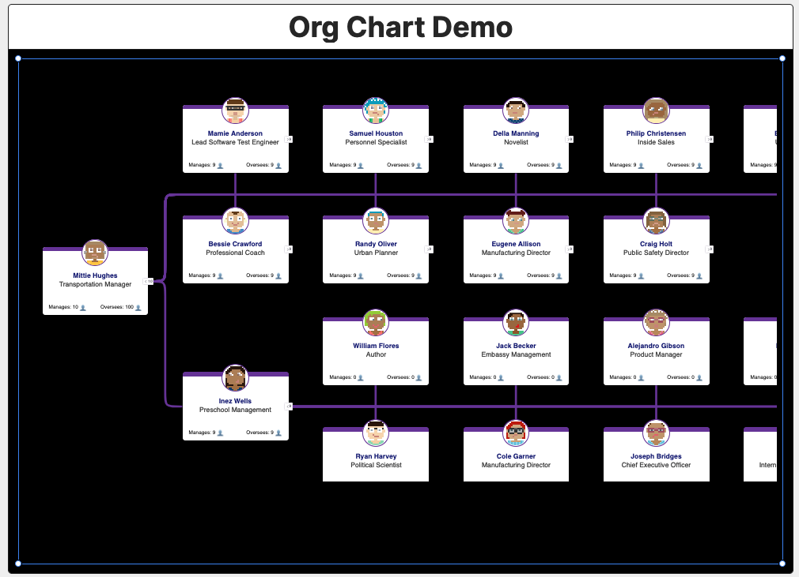
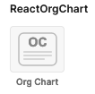
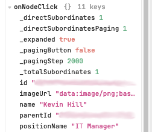

# Retool Org Chart

Retool Custom Component Wrapper for https://github.com/bumbeishvili/org-chart



## Deploy in Retool

1.  Checkout the repo

    > `git clone https://github.com/fortunabmc/retool-org-chart`

2.  Install dependencies

    > `npm install`

3.  Login to Retool

    > `npx retool-ccl login`

4.  Deploy to Retool

    > `npx retool-ccl deploy`

5.  Component will be available in Retool Editor
    > 

## Configure via Retool Editor


### User List

The user list is an array of objects, defining the heirarchy and user info.

The following is an example interface for the component.

```ts
interface IUser {
  // mandatory props
  id: string | number;
  parentId: null; // `null` for the root node or an id of another `IUser`
  // optional data
  name: string;
  email: string;
  position: string;
  imageUrl: string;
  // ...
}
```

The underlying library will extend your `IUser` objects with the following additional properties.

```ts
interface NodeProps {
  _expanded: boolean;
  _pagingStep: number;
  _pagingButton: boolean;
  _totalSubordinates: number;
  _directSubordinates: number;
  _directSubordinatesPaging: number;
}
```

### Node Template CSS & Node Template HTML

Under the hood, these two fields use [Mustache.js](https://github.com/janl/mustache.js) as a template engine.

The delimeters have been set to `<?` and `?>` to prevent interferenece with Retool's `{{ vars }}`

Both the CSS and HTML templates have the user object as `<? user.PROP ?>` and the additional props defined in `NodeProps`.

If your user object has `user.name = "Tom"` then in the HTML template you can use `<? user.name ?>`.

Also available are:

- `<? node.width ?>`
- `<? node.height ?>`
- `<? node.lineColor ?>`

## Examples with variable interpolation

### Template CSS

```css
.container {
  margin-left: 1px;
  border-radius: 6px;
  overflow: visible;
  height: <? node.height ?>px;
  background-color: #fff;
}

.content {
  height: calc(<? node.height ?>px - 32px);
}

.userpic {
  width: 60px;
  height: 60px;
  margin-top: -20px;
  background-color: #fff;
  margin-left: calc(<? node.width ?>px / 2 - 33px);
  border-radius: 100px;
  border: 2px solid <? node.linkColor ?>;
}

.hr {
  margin-top: -48px;
  height: 10px;
  border-radius: 6px 6px 0 0;
  background-color: <? node.linkColor ?>;
}

.footer {
}
```

## Example Template HTML

```html
<div class="container">
  <div class="content">
    "
    />
    <div class="hr"></div>
    <div class="userinfo">
      <div class="name"><? user.name ?></div>
      <div class="position"><? user.position ?></div>
    </div>
    <div class="footer">
      <div>Manages: <? user._directSubordinates ?> 👤</div>
      <div>Oversees: <? user._totalSubordinates ?>👤</div>
    </div>
  </div>
</div>
```

## Events

### onNodeClick

When a node is clicked, the `IUser` with `NodeProps` will be set to the `onNodeClicked` state property of the Component.



## Org Chart Options

<!-- EMBED:START -->

| Name                 | Type        | Description                                                                                                                 | Initial Value   | Inspector | Enum Definition          |
| -------------------- | ----------- | --------------------------------------------------------------------------------------------------------------------------- | --------------- | --------- | ------------------------ |
| User List            | array       | Array of users with `id` and `parentId`                                                                                     |                 |           |                          |
| Layout Style         | enumeration | Direction of layout for the tree                                                                                            | left            | segmented | left, top, bottom, right |
| Show Control Buttons | boolean     |                                                                                                                             | true            | checkbox  |                          |
| Node Height          | number      | Height of the rendered node                                                                                                 | 200             |           |                          |
| Node Width           | number      | Width of the rendered node                                                                                                  | 250             |           |                          |
| Parent / Child Gap   | number      | Vertical spacing between parent and children                                                                                | 60              |           |                          |
| Siblings Gap         | number      | Horizontal spacing between sibling nodes                                                                                    | 60              |           |                          |
| Neighbor Spacing     | number      | Horizontal spacing between groups of child nodes                                                                            | 80              |           |                          |
| Child X Gap          | number      | Horizontal spacing between sibling child nodes                                                                              | 100             |           |                          |
| Child Y Gap          | number      | Vertical spacing between sibling child nodes                                                                                | 50              |           |                          |
| Link Width           | number      | Stroke width of the links between nodes                                                                                     | 2               |           |                          |
| Link Color           | string      | Color for the links between nodes                                                                                           | #FFF            |           |                          |
| Node Template CSS    | string      | CSS for rendering the nodes. Define classes and use them in node HTML. EX: <p class="styled">Hello <? user.name ?></p>      |                 |           |                          |
| Node Template HTML   | string      | HTML template for rendering the nodes. User and Node props available as vars to templates. EX: <p>Hello <? user.name ?></p> |                 |           |                          |
| onNodeClick          | object      |                                                                                                                             | [object Object] | hidden    |                          |

<!-- EMBED:END -->

# Example App

[A Demo Retool App json is also available for import.](./example/OrgChartDemo.json)
