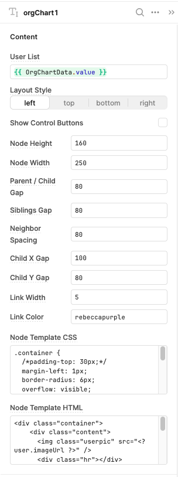

## Retool Org Chart

## Node Template HTML

This uses [Mustache.js](https://github.com/janl/mustache.js) as the template for the node display.

The delimeters have been set to `%name%` to prevent interferenece with Retool's `{{ vars }}`

